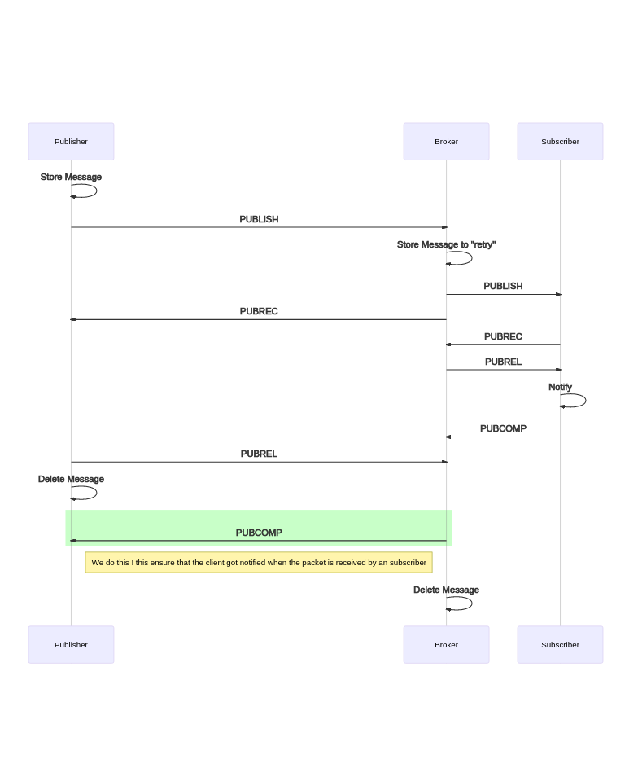

# MGTT

Another M(Go)TT-Broker written in Go

THIS PROJECT IS MAINTAINED ON GITLAB.COM ( https://gitlab.com/stackshadow/mgtt ) Please create feature requests or bugs there :)

## Usage

Read the docs in the ./docs folder

## Why

All the other broker, that i checked, are complicated to read/understand.
This broker should be easy and understandable with some extra sugar



## Features

- [x] Connect ( CONNECT / CONACK )
- [x] Ping ( PINGREQ/PINGRESP )
- [x] Publish ( PUBLISH / PUBACK )
- [x] Subscribe ( SUBSCRIBE / SUBACK )
- [x] Unsubscribe
- [x] QoS 0 messages
- [x] QoS 1 messages
- [x] QoS 2 messages
- [x] Retained messages stored on [boltdb](https://github.com/boltdb/bolt) on disk
- [x] Automatic resending of failed packets
- [x] Will message
- [x] Plugins
- [x] TLS/SSL
- [x] Disconnect
- [x] Sessions

- [x] Zerolog with terminal-output and json-output-support
- [x] Kong command-line-parser with environment-support
- [x] Dockerfile
- [ ] Healthcheck
- [x] Docker-Compose
- [ ] Build with buildah

## Plugins

- [x] Username/Password auth
- [x] ACL
- [ ] Metrics
- [x] $SYS-Support

# Build

Of course, you need `Go` and `git`

- Clone this repository

```
git clone https://gitlab.com/stackshadow/mgtt.git --depth 1
```

- build mgtt

```
CGO_ENABLED=0 GOOS=linux go build -a -ldflags '-extldflags "-static"' -o mgtt .
```

# Usage

For a small help use `mgtt -h`
